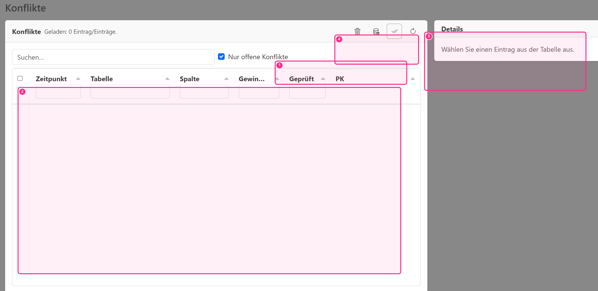

# Betrieb & Datenbank

FMB Log speichert alle Daten in einer einzelnen SQLite‑Datei. Dadurch ist kein Datenbankserver notwendig und die Anwendung kann auch offline betrieben werden.

## Standard‑Datenbankpfad

Standardmäßig liegt die Datenbank im Programmordner unter `resources/fmblog.db`. Beim ersten Start legt die Anwendung das Unterverzeichnis `resources` an (falls es fehlt) und erstellt die Datenbankdatei beim Öffnen automatisch.

Dieser Standard ist bewusst gewählt: Die Datenbank ist damit leicht auffindbar, einfach zu sichern und kann (sofern gewünscht) auch auf einen gemeinsam genutzten Pfad gelegt werden.

## Stub‑DB und Updates

Für Neuinstallationen oder Updates kann eine **Stub‑Datenbank** mitgeliefert werden. Beim ersten Start wird dann (falls noch keine Datenbank existiert) `resources/fmblog.stub.db` aus den gebündelten Ressourcen nach `resources/fmblog.db` kopiert.

Wichtig: Eine vorhandene Datenbank wird dabei **niemals überschrieben**. Damit bleiben Bestandsdaten bei Updates erhalten.

## Datenmodell (ER)

Eine vereinfachte Darstellung des SQL-Schemas als ER-Diagramm finden Sie hier:

## Netzlaufwerk und Mehrbenutzer

SQLite kann grundsätzlich auf Netzlaufwerken funktionieren, allerdings hängt die Stabilität stark von Dateisperren/Locking, SMB‑Konfiguration (z. B. OpLocks) und der Latenz/Zuverlässigkeit des Shares ab. In Mehrbenutzer‑Szenarien kommt es typischerweise nicht auf „viele Leser“, sondern auf **gleichzeitige Schreibzugriffe** an.

Empfehlung: Validieren Sie den Mehrbenutzerbetrieb zunächst in einer Testumgebung und definieren Sie organisatorisch, wer wann Änderungen schreibt (z. B. Import zentral, Auswertung verteilt). Wenn regelmäßig Sperren oder Zeitüberschreitungen auftreten, ist ein lokaler DB‑Pfad pro Nutzer die robustere Variante.

## Synchronisation (Hub‑DB und lokale Replica)

Für den Mehrnutzerbetrieb nutzt FMB Log eine **lokale Replica‑DB** (pro Windows‑Benutzer) und synchronisiert diese regelmäßig mit einer **Hub‑DB** (z. B. im gemeinsamen Datenordner / Netzlaufwerk):

- **Hub‑DB:** entspricht dem in den Einstellungen gesetzten DB‑Pfad (oder dem Standard unter `resources/fmblog.db`)
- **Lokale Replica:** wird im Benutzerprofil unter `AppData/Local/<app-id>/replicas/…` angelegt
- **Sync:** läuft automatisch (z. B. beim Fokuswechsel und alle ~10 s)

### Warum lokale Replica + CRDT?

Ein reiner SQLite‑Mehrbenutzerbetrieb über ein Netzlaufwerk ist oft fragil (Dateisperren, OpLocks, Latenz). Die Replica‑Architektur reduziert dieses Risiko deutlich:

- **Offline‑fähig:** Die Anwendung bleibt auch bei temporär nicht verfügbarem Hub nutzbar (Arbeit in der lokalen Replica).
- **Weniger Lock‑Druck auf dem Share:** Nutzer schreiben hauptsächlich lokal; der Hub wird kurz/periodisch synchronisiert.
- **Konfliktbehandlung:** Gleichzeitige Änderungen können deterministisch zusammengeführt werden (CRDT/CR‑SQLite).

### Wie funktioniert CR‑SQLite (CRR) in FMB Log?

FMB Log verwendet CR‑SQLite, um Tabellen als **CRR (Conflict‑free Replicated Relations)** zu betreiben. Vereinfacht:

- Jede DB‑Instanz hat eine eigene **Site‑ID**.
- Änderungen werden von CR‑SQLite als **Change‑Events** erfasst (`crsql_changes`).
- Beim Sync werden neue Change‑Events zwischen lokaler Replica und Hub ausgetauscht und angewendet.

Wichtig: Das Ergebnis ist **eventual consistency**. Nach erfolgreichem Sync konvergieren alle Replicas (deterministisch) auf denselben Zustand – ohne dass die Anwendung dazu File‑Locks “manuell” koordinieren muss.

### Sync‑Ablauf (automatisch)

Der Sync läuft automatisch und “best effort”:

- Beim Start wird ein initialer Sync versucht.
- Zusätzlich bei Fokuswechsel (zurück zur App) und periodisch alle ~10 s.
- Technisch werden erst **Änderungen aus dem Hub in die lokale Replica gezogen** (Pull) und danach **lokale Änderungen in den Hub geschrieben** (Push).

### Einschränkungen (wichtig)

Auch mit CRDT/CR‑SQLite gibt es Grenzen und “Betriebsregeln”:

1. **Konflikte sind möglich (und werden aufgelöst)**  
   Wenn zwei Nutzer *dieselbe* Entität gleichzeitig bearbeiten, greift eine deterministische Merge‑Regel. In der Praxis bedeutet das oft “Last‑Write‑Wins” auf Feld‑/Zellenebene.  
   Empfehlung: Kritische Stammdaten (FGW/NV/FMK) organisatorisch nur durch wenige Key‑User ändern lassen.

- (1) Filter „Nur offene Konflikte“
- (2) Konfliktliste (Tabelle)
- (3) Details zum ausgewählten Eintrag
- (4) Toolbar‑Aktionen (z. B. als geprüft markieren)

2. **Schema‑Constraints für CRR‑Tabellen**  
   CR‑SQLite stellt Anforderungen an das Schema (u. a. nicht‑nullable Primary Keys; keine `NOT NULL`‑Spalten ohne Default‑Wert).  
   Daraus folgt: IDs sind in FMB Log als **stabile, eindeutige TEXT‑IDs** ausgelegt (statt Auto‑Increment), und Schema‑Änderungen erfolgen über App‑Migrations.

3. **Netzwerk‑/Share‑Qualität bleibt entscheidend**  
   Der Hub ist weiterhin eine SQLite‑Datei. Wenn das Share instabil ist (Locking, hohe Latenz), kann es trotz Replica‑Ansatz zu Sync‑Fehlern kommen. Die App bleibt dann lokal nutzbar, aber Änderungen können erst später verteilt werden.

4. **Große BLOBs kosten Sync‑Zeit**  
   Messprotokolle werden bewusst **nicht** als BLOB in der CRDT‑SQLite synchronisiert. Stattdessen werden sie zstd‑komprimiert in einem Protokoll‑Archiv **neben der Hub‑DB** gespeichert und in der DB nur referenziert (BLAKE3, Archivdatei, Offset/Länge, optional `dict_id`).  
   Ergebnis: Der CR‑SQLite‑Sync bleibt schnell, weil er nur Metadaten synchronisiert.

   **Ablage im Hub‑Ordner (neben `<db>.db`)**:
   - `protocols/<site-id-hex>/pack-*.bin` (Packfiles, append‑only; max. ~100 Einträge oder ~1 MB pro Pack)
   - `protocols/<site-id-hex>/state.json` (merkt sich das aktuelle Packfile)
   - DB‑Referenzen in `measurement_protocols` (`pack_file`, `pack_offset`, `pack_length`, `blake3`, `dict_id`, …)
   - Hinweis: Die Spalte `sha256` existiert nur für Abwärtskompatibilität und ist für neue Imports i. d. R. leer (maßgeblich ist `blake3`).

   **Offline‑Import:** Wenn der Hub nicht erreichbar ist, wird das Protokoll im **lokalen Cache** abgelegt und die DB enthält zunächst eine „ausstehende“ Referenz (`pack_file=''`, `pack_length=0`). Zusätzlich wird lokal eine Outbox geführt (`protocol_upload_outbox`), die Upload‑Versuche, Backoff und Fehlerstatus verwaltet (Status ist auf der Import‑Seite in „Ausstehende Uploads“ sichtbar). Nach dem nächsten erfolgreichen Sync lädt der importierende Client das Protokoll automatisch in das Hub‑Archiv hoch und aktualisiert die Referenz. Bis dahin können andere Clients die Messung sehen, das Protokoll aber noch nicht öffnen.

### Besonderheit: Vault‑Dateien sind nicht Teil der DB‑Synchronisation

Passwörter und Signierschlüssel werden zusätzlich in **Stronghold‑Vaults** gespeichert:

- Nutzer‑Vaults: `vaults/<user_id>.vault`
- Integritäts‑Vault: `vaults/<db>.integrity.vault`

Diese Dateien liegen **neben der Hub‑DB** im gemeinsamen Datenordner und werden **nicht** über die DB‑Synchronisation repliziert. Daher gilt:

- Kritische Admin‑Operationen (Benutzer-/Gruppen-/Rechteverwaltung, Integritätsschlüssel) sollten nur durchgeführt werden, wenn der Hub‑Pfad erreichbar ist.
- Wenn der Hub‑Pfad nicht erreichbar ist, sind diese Aktionen in der UI deaktiviert (die Fach‑/Messdaten können weiterhin über die lokale Replica bearbeitet werden).

## Backup

Die sicherste Backup‑Strategie ist, die relevanten Dateien zu kopieren, wenn die Anwendung geschlossen ist. Für den Betrieb empfiehlt sich eine regelmäßige Sicherung (z. B. täglich) und eine Aufbewahrung mehrerer Generationen (Rotation), damit auch ältere Tagesabrechnungen nachvollziehbar bleiben.

Sichern Sie im Hub‑Ordner mindestens:

- die DB‑Datei (`<db>.db` bzw. `fmblog.db`)
- den Ordner `protocols/` (Protokoll‑Archive/Packfiles)
- den Ordner `vaults/` (Stronghold‑Vaults für Pepper/Integritätsschlüssel)

::: info Zusammenfassung (Datenbank)
- Eine Datei: SQLite `resources/fmblog.db` (Standardpfad).
- Optional: Stub‑DB `resources/fmblog.stub.db` wird nur kopiert, wenn noch keine DB existiert.
- Netzlaufwerke sind möglich, aber lock-/latency‑abhängig → vorher testen.
- Mehrnutzerbetrieb: lokale Replica + CR‑SQLite Sync (eventual consistency).
- Protokolle liegen als Packfiles im Hub‑Ordner (`protocols/…`), nicht als BLOB in der DB.
- Backups am besten bei geschlossener Anwendung.
:::
