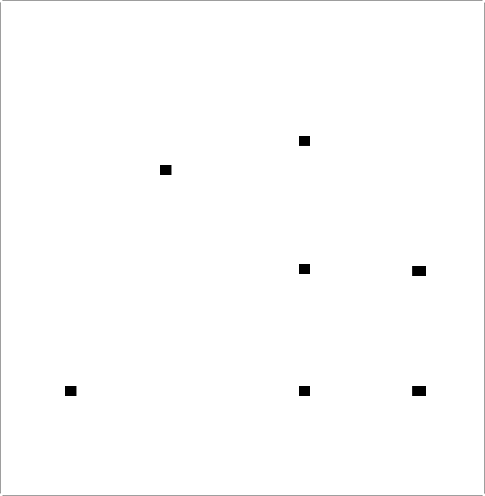

# Datenmodell (vereinfacht)

Die Anwendung nutzt SQLite. Das Modell ist auf Nachvollziehbarkeit ausgelegt (Revisionen statt Überschreiben).

## Entitäten & Beziehungen (fachlich)

Zusätzlich gibt es eine vereinfachte fachliche Sicht auf die Hauptentitäten und deren Beziehungen:

## SQL-Schema (ER)

Zusätzlich ist das SQL-Schema als Entity-Relationship-Diagramm (D2 `sql_table`) verfügbar:

Hinweis: Die tatsächlichen Tabellen-/Spaltennamen können abweichen; diese Seite dient als Orientierung.
