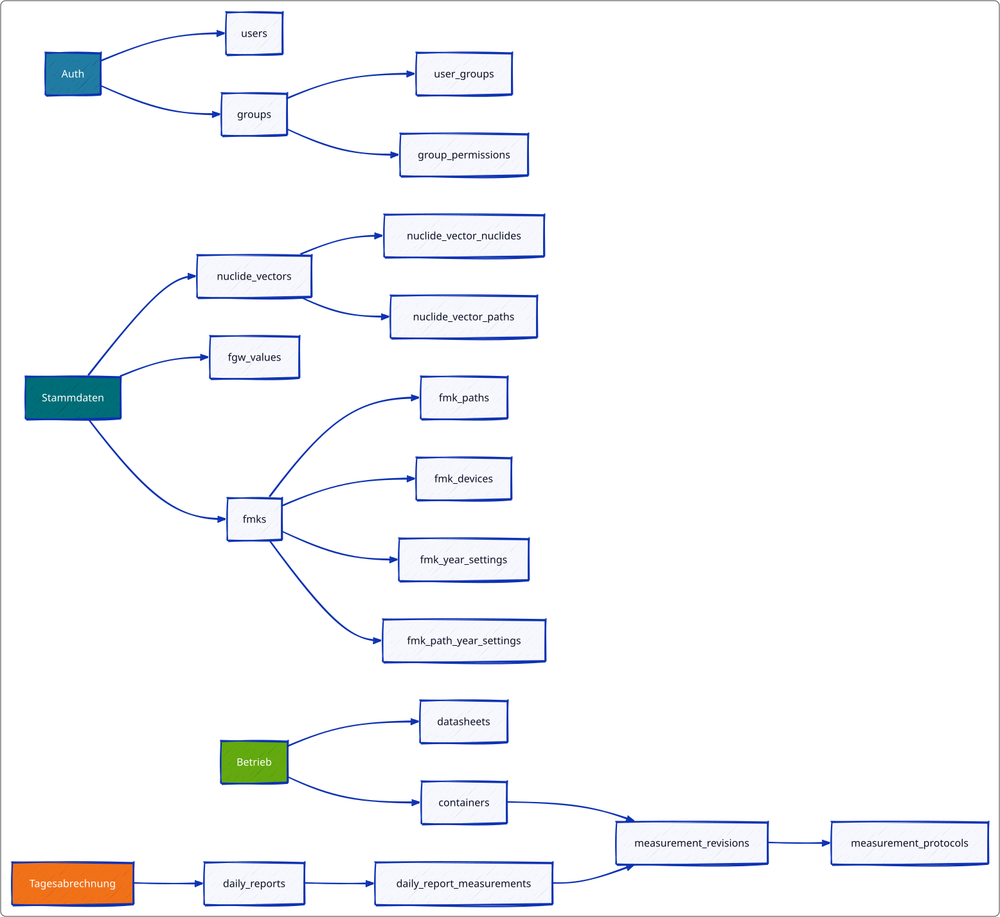
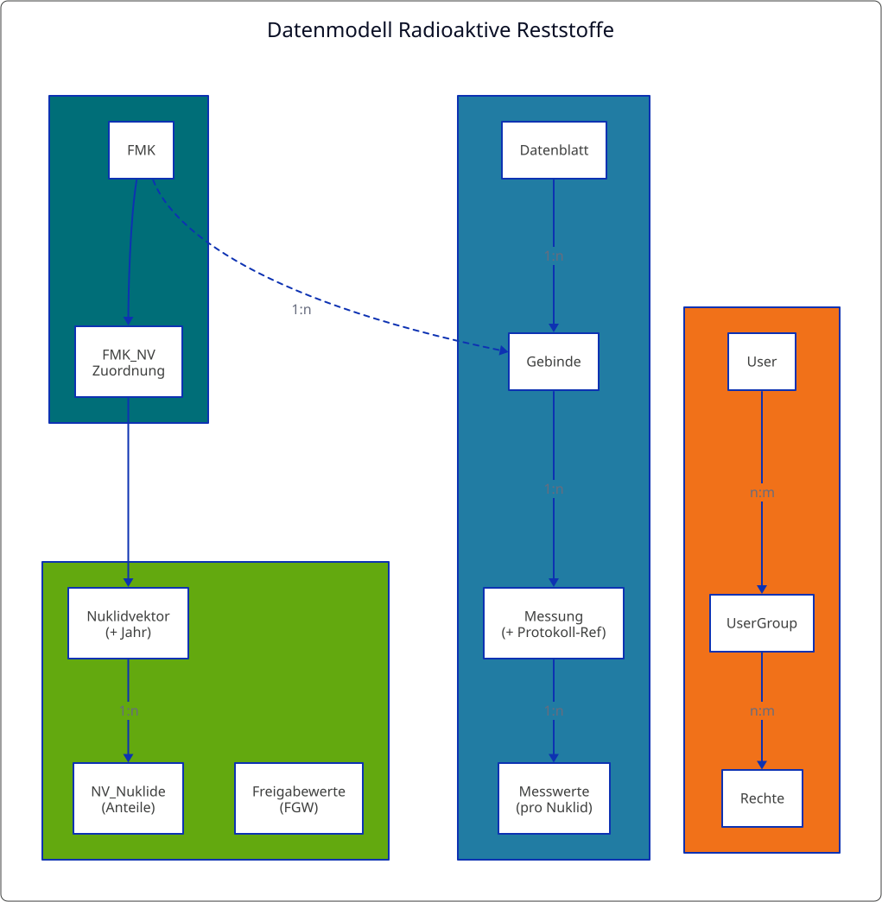
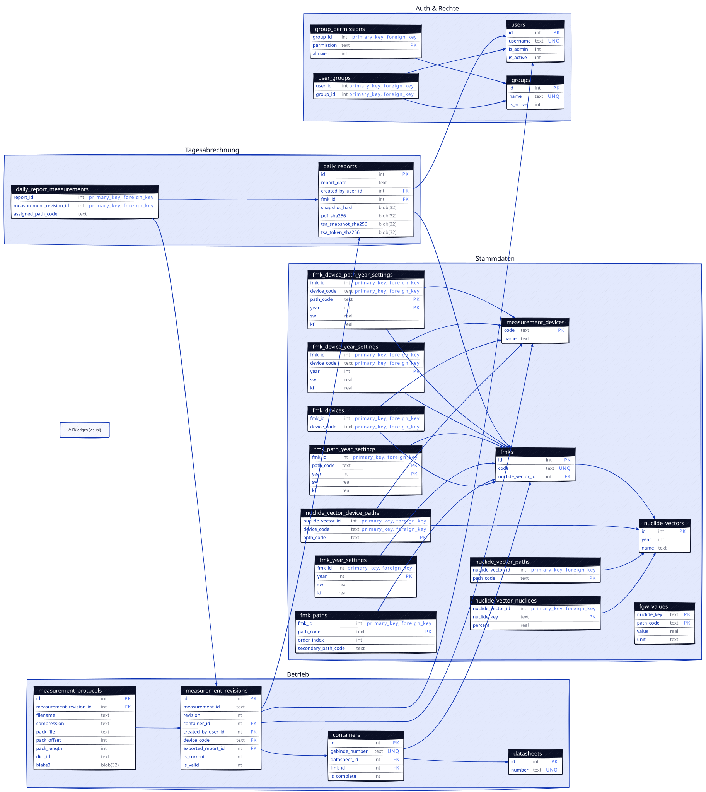

# Datenmodell (vereinfacht)

Die Anwendung nutzt SQLite. Das Modell ist auf Nachvollziehbarkeit ausgelegt (Revisionen statt Überschreiben).

## Entitäten & Beziehungen (fachlich)

Zusätzlich gibt es eine vereinfachte fachliche Sicht auf die Hauptentitäten und deren Beziehungen:

## SQL-Schema (ER)

Zusätzlich ist das SQL-Schema als Entity-Relationship-Diagramm (D2 `sql_table`) verfügbar:

Hinweis: Die tatsächlichen Tabellen-/Spaltennamen können abweichen; diese Seite dient als Orientierung.

## Gebindeabrechnung

`daily_reports` speichert weiterhin die Exporte. Snapshots ab Version 4 ergänzen die eindeutigen Messrevisionen um Chargen-/Stoffklassenblätter und Maximalwertzeilen; `daily_report_measurements` enthält jede verwendete Revision nur einmal. Die vorhandenen `material_masses_json` und `batches_json` liefern Reststoffanteile und eindeutige Chargenzuordnungen. Version 5 speichert zusätzlich die jahresbezogenen Pfadentscheidungen und deren Bestätigungsgrundlagen. Version-3- und Version-4-Snapshots bleiben unverändert lesbar. Siehe [ADR-005](../architecture/adr-005-gebindeabrechnung.md).

Jahresbezogene FMK-Ausnahmen verwenden das bestehende signierte JSON-Feld der FMK-Pfade; Details stehen in [ADR-006](../architecture/adr-006-jahresbezogene-fmk-bestaetigungen.md).
