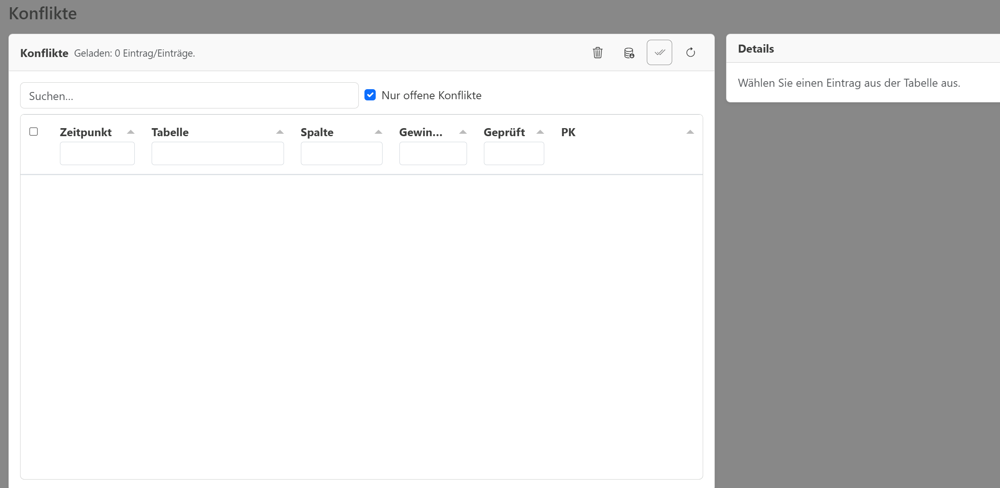

# Screenshots

This folder contains screenshots used in the documentation.

## Referencing in Markdown

Prefer stable, descriptive filenames without spaces (e.g. `reports-history.png`) to keep links readable.

Example:

```md

```

## Zoom in the docs

Images in the docs are clickable to open a larger view (lightbox). To opt out for a specific image, use
inline HTML and add `class="no-zoom"`:

```html

```

## Annotated / numbered highlights

For numbered frames/highlights, consider keeping an annotated copy next to the original, e.g.
`some-image.annotated.png`, so the enlarged view shows the annotations as well.

Annotated screenshots are generated via:

```bash
pnpm -s docs:screenshots:annotate
```

The boxes/numbers are defined in `scripts/annotate_screenshots.config.mjs`. You can pass a filter (e.g.
`import`) to only (re)generate a subset.
