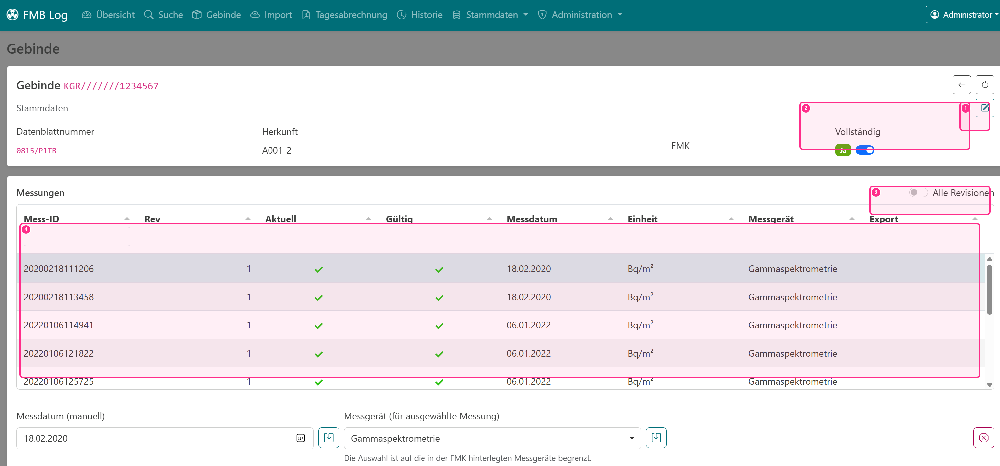
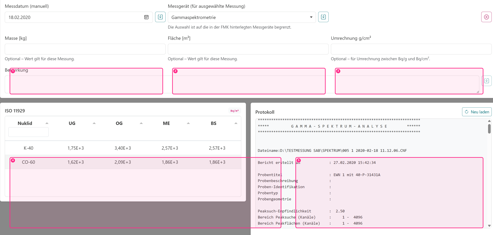

# Gebinde & Messungen

In FMB Log ist ein **Gebinde** die zentrale Einheit. Messungen (aus Protokollen) werden immer einem Gebinde zugeordnet, damit Sie später:

- alle Messungen eines Gebindes gesammelt sehen,
- deren Historie nachvollziehen können (Revisionen),
- und daraus Tagesabrechnungen erzeugen.

## Gebindeübersicht

Unter **Gebinde** finden Sie eine tabellarische Übersicht. Über die Filterzeile können Sie schnell nach Gebindenummer, Datenblatt oder FMK suchen. Ein Klick auf eine Zeile öffnet die Detailansicht.

Die Spalte **Messungen** zählt bewusst nur die **aktuellen Revisionen**. Das macht die Übersicht übersichtlich, auch wenn einzelne Messungen im Laufe der Zeit aktualisiert wurden.

- (1) Stammdaten bearbeiten (Stift-Symbol)
- (2) Arbeitsstatus „Vollständig“
- (3) Umschalten zwischen „aktuellen Revisionen“ und „Alle Revisionen“
- (4) Messungsliste (zeigt standardmäßig nur aktuelle Revisionen)

::: info In der Übersicht sehen Sie
- Gebindenummer, Datenblattnummer, Herkunft, FMK
- „Vollständig" als Arbeitsstatus (keine weiteren Messungen erwartet)
- Anzahl Messungen (nur aktuelle Revisionen)
:::

## Gebinde-Details

In der Detailansicht bearbeiten und prüfen Sie ein Gebinde. Typische Aufgaben sind:

- Stammdaten am Gebinde (Herkunft, Datenblatt, FMK) ergänzen,
- Messdaten pro Messung (Masse/Fläche, Umrechnung, Bemerkung) ergänzen oder korrigieren,
- den Status **Vollständig** setzen oder zurücknehmen,
- Messungen auswählen und Protokolle/ISO-Werte prüfen,
- Messungen bei Bedarf als **ungültig** markieren (mit Begründung).

Die Messungsliste kann zwischen **aktuelle Revisionen** und **alle Revisionen** umgeschaltet werden. So bleibt die Arbeitsansicht übersichtlich, während die Historie jederzeit verfügbar ist.

### Stammdaten am Gebinde ändern

Die Gebinde-Stammdaten (Herkunft, Datenblattnummer, FMK) werden in der Detailansicht im Bereich **Stammdaten** angezeigt. Über die Schaltfläche **Stammdaten bearbeiten** (Stift-Symbol) können die Werte geändert und gespeichert werden.

::: warning Hinweis
Beim Import werden Stammdaten eines **bestehenden** Gebindes nicht geändert. Wenn Sie Korrekturen vornehmen müssen (z. B. falsche FMK oder Datenblattnummer), erledigen Sie das im Menü **Gebinde** in der Detailansicht.
:::

Für das Ändern dieser Werte ist die Berechtigung `measurements.update` erforderlich (oder Admin).

### Protokoll und ISO-Tabelle

Wenn Sie eine Messung auswählen, lädt die Anwendung das gespeicherte Protokoll und zeigt die ISO-11929-Werte (sofern im Protokoll vorhanden). Das Originalprotokoll wird archiviert, damit es auch später (z. B. für Nachweise) wieder angezeigt werden kann.

- (1) Masse (pro Messung)
- (2) Fläche (pro Messung)
- (3) Umrechnung $g/cm^2$ (optional)
- (4) ISO‑11929 Tabelle
- (5) Protokoll (Archiv)

Bei einem **Offline-Import** kann es vorkommen, dass das Protokoll noch nicht hochgeladen wurde. In diesem Fall ist das Protokoll zunächst nur auf dem importierenden Rechner abrufbar, bis nach dem nächsten erfolgreichen Sync der Upload automatisch nachgeholt wurde.

### Messgerät nachtragen/anpassen

Wenn eine Messung kein Messgerät hat oder ein falsches Messgerät hinterlegt ist, kann es (mit entsprechender Berechtigung) in der Detailansicht korrigiert werden. Das ist relevant, weil die zulässigen Freigabepfade je nach Messgerät variieren können.

### Messdatum manuell korrigieren

In der Praxis kommt es vor, dass das Protokolldatum (z. B. durch Geräteeinstellungen) nicht dem tatsächlichen Messtag entspricht. Daher kann das Messdatum **manuell** gesetzt werden. Die Anwendung speichert dabei:

- das ursprüngliche Datum aus dem Protokoll (zur Nachvollziehbarkeit),
- und das manuell gesetzte Datum als separate Information.

In Tabellen wird eine manuell gesetzte Angabe durch ein Stift-Symbol kenntlich gemacht. Für das Ändern des Messdatums ist die Berechtigung `measurements.update_date` erforderlich.

### Messung ungültig setzen

Wenn eine Messung fachlich nicht verwertbar ist (z. B. falsches Gebinde, falsche Parameter, Messfehler), kann sie als **ungültig** markiert werden. Eine Begründung ist Pflicht. Ungültige Messungen bleiben erhalten, werden aber bei „aktuellen/gültigen" Auswertungen nicht mehr berücksichtigt.

::: info Zusammenfassung (Detailansicht)
- Vollständig-Status steuert, ob Gebinde standardmäßig in Tagesabrechnungen erscheinen.
- Protokoll und ISO-Tabelle werden aus dem Archiv geladen.
- Manuelles Messdatum bleibt nachvollziehbar (Original + Override).
- Ungültige Messungen bleiben dokumentiert, werden aber nicht mehr als gültig ausgewertet.
:::

## Messungen & Revisionen (Versionierung)

Messungen werden über eine **Mess-ID** identifiziert. Beim erneuten Import derselben Mess-ID legt die Anwendung eine **neue Revision** an. Die vorherige Revision wird nicht überschrieben, sondern als nicht mehr aktuell markiert.

Dieses Vorgehen ist bewusst gewählt, weil Messungen und Auswertungen häufig nachvollziehbar dokumentiert werden müssen: Sie können später sehen, **wann** eine Messung geändert wurde und **welche Version** aktuell gilt.

::: info Warum Revisionen?
- Keine Daten gehen verloren (Audit-Trail statt „Überschreiben").
- Sie können Korrekturen vornehmen, ohne alte Werte zu zerstören.
- Auswertungen (z. B. Tagesabrechnung) beziehen sich immer auf eine definierte, gültige Revision.
:::

## Optionale Raster für 7-m³-Mulden

In den Gebindestammdaten steht **Gebindetyp / Raster** zur Auswahl: kein Raster,
symmetrische oder asymmetrische 7-m³-Mulde. Grundlage sind die beiden
Rasterflächen-PDFs aus `RPT`. Ohne gewählten Typ bleibt das bisherige Verhalten
bestehen; fehlende Rasterzuordnungen blockieren keine Freigabe oder Tagesabrechnung.

Die symmetrische Vorlage umfasst A/C mit 2 × 1, B/D mit 4 × 2, Boden E mit
2 × 2 und Deckel F mit 5 × 2 Flächen. Die asymmetrische Vorlage hat A mit
2 × 2 und keinen Deckel F; die übrigen Rastergrößen stimmen überein.
Jede Fläche ist getrennt für innen und außen zuordenbar.

### Orientierung

Die Innenansicht ist die feste Referenz: beim Blick auf die Wand läuft die
erste Koordinate an A von links 1→2, an B und D 4→1, an C 2→1. Die zweite
Koordinate steigt von unten nach oben. Auf E und F läuft die erste Koordinate
von A nach C, die zweite von D nach B. Die frei gewählte A-Wand einer
symmetrischen Mulde muss am realen Gebinde eindeutig gekennzeichnet sein.

**Außen ist die Projektion der Innenseite:** A innen 1/1 und A außen 1/1
liegen sich gegenüber. Die 2D-Außenansicht zeigt diese Innenprojektion.
Im drehbaren 3D-Modell bleiben die Kennungen fest am Bauteil; die Kameraposition
ändert keine Nummerierung. Die Oberseite einer Ablage gehört zum oberen,
ihre Unterseite zum unteren Raster. Übergreifende Anbauten werden der Fläche
mit dem überwiegenden Strukturanteil zugeordnet.

### Messungen und einzelne MC2-Punkte zuordnen

Eine oder mehrere Messungen in der Messungstabelle auswählen und im Rasterbereich
**Auswahl aus Messungstabelle übernehmen** verwenden. Bei MicroCont 2 werden dabei
alle Punkte ausgewählt; einzelne Punkte lassen sich danach abwählen. Rasterflächen
anklicken oder über die zugängliche Flächenliste wählen und **Rasterflächen hinzufügen**
betätigen. Eine Messung beziehungsweise ein Punkt darf mehreren Flächen zugeordnet
sein; jede Fläche darf mehrere Messungen enthalten. Hinzufügen ergänzt bestehende
Zuordnungen, ohne sie zu ersetzen. Innen und außen sind unabhängig.

**Zuordnung entfernen** entfernt die gewählten Verknüpfungen. Vor einem Typwechsel
müssen alle Zuordnungen aktueller Revisionen ausdrücklich entfernt werden.
Historische Revisionen behalten ihre ursprüngliche Vorlage und Zuordnungen;
sie sind im Revisionsmenü des Rasterbereichs schreibgeschützt einsehbar.
Neu importierte Messungsrevisionen beginnen ohne Rasterzuordnungen, damit
geänderte MC2-Punkte keine alten Positionen übernehmen.

### Raster- und Messwertansicht

Die Rasteransicht zeigt Kennungen und Belegung. Die Messwertansicht zeigt je Fläche
die höchste obere Grenze (OG) der Gesamtaktivität aus den aktuellen gültigen
zugeordneten Messungen beziehungsweise MC2-Punkten. Umschaltbar sind Bq/g und
Bq/cm². Bei MC2 fließen nur die dieser Fläche zugeordneten Punkte ein.
Die bestehenden Nuklidvektoren und Umrechnungsfaktoren werden verwendet; es erfolgt
keine Aufteilung oder Summierung über mehrfach zugeordnete Flächen und keine
zusätzliche pfadabhängige Freigabekorrektur.

Ein Klick auf eine Fläche zeigt die beitragenden Werte und die Quelle des Maximums.
Fehlende Umrechnung oder Berechnungsgrundlagen erscheinen als nicht berechenbar,
nicht als Nullwert. Die Farbskala gilt für das gesamte Gebinde einschließlich innen
und außen; sie ist keine Freigabebewertung.

2D-Raster und interaktives 3D-Modell verwenden dieselben Daten. Das Modell lässt
sich drehen und zoomen; Wände sind einzeln darstellbar und der symmetrische Deckel
kann ausgeblendet werden. Es ist schematisch und liefert keine Messflächen.
Ohne WebGL bleibt die 2D-Ansicht vollständig bedienbar.

Zuordnungsänderungen benötigen die Berechtigung zum Ändern von Messungen und
werden atomar signiert und protokolliert. Betroffene Tagesabrechnungen werden
nach Angabe eines Grundes ungültig. Rastertyp und Zuordnungen werden synchronisiert;
alle beteiligten Clients müssen die Rastererweiterung unterstützen. Bestehende
Signaturen ohne Rasterdaten bleiben gültig.
