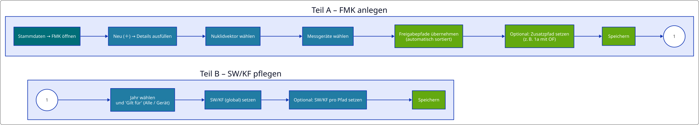
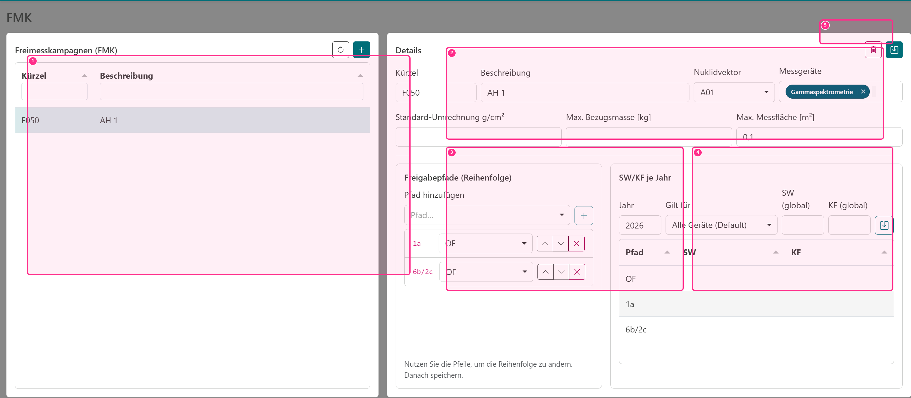

# FMK (Freimesskampagne)

Eine **FMK** bündelt Gebinde in einer gemeinsamen Kampagne und beschreibt, **wie** Messungen bewertet werden sollen. In der Praxis ist die FMK der „Regel‑Container“: Sie verknüpft einen Nuklidvektor mit Messgeräten und legt fest, welche Freigabepfade in welcher Reihenfolge geprüft werden.

## Was wird in einer FMK festgelegt?

Eine FMK enthält typischerweise:

- einen **Nuklidvektor (NV)** als fachliche Grundlage,
- ein oder mehrere **Messgeräte** (welche Protokolle/Verfahren in dieser FMK vorkommen dürfen),
- die **Reihenfolge** der Freigabepfade (Prüfpfade),
- optionale Standardwerte (Umrechnung $g/cm^2$, Bezugsmasse/‑fläche),
- sowie **SW/KF** als Korrekturen pro Jahr und ggf. geräte-/pfadspezifisch.

Die Jahreszuordnung ergibt sich dabei aus dem Messdatum der jeweiligen Messung: Für eine Messung im Jahr 2026 wird die FMK‑Konfiguration für 2026 herangezogen.

## Ablaufdiagramm

- (1) FMK‑Liste + Neu
- (2) Details (Kürzel, NV, Messgeräte)
- (3) Freigabepfade (Reihenfolge)
- (4) SW/KF je Jahr
- (5) Speichern/Löschen

## Freigabepfade (Reihenfolge)

Die Prüfung erfolgt in der FMK in einer festgelegten Reihenfolge. Die Anwendung prüft pfadweise und weist einem Gebinde den **ersten** Pfad zu, den **alle** gültigen Messungen des Gebindes bestehen. Damit entspricht die Auswertung dem üblichen Vorgehen: Man startet mit den „strengeren“/kleineren Pfaden und arbeitet sich nach oben.

In der UI ändern Sie die Reihenfolge über Pfeil‑Buttons. Zusätzlich können Pfade manuell ergänzt werden. Bei Auswahl eines Nuklidvektors werden die geprüften/zulässigen Pfade automatisch übernommen und sinnvoll sortiert; manuell hinzugefügte Pfade bleiben erhalten.

### Pfadprüfung je Messjahr

Unter **Pfadprüfung je Messjahr** wählen Sie das Messjahr. Angeboten werden vorhandene Messjahre, Jahre gespeicherter Bestätigungen und das aktuelle Jahr; weitere Jahre können eingegeben werden. Die Anzeige nennt den **tatsächlich verwendeten NV**. Gibt es keine passende Jahresversion, gilt wie bei der Abrechnung zuerst die nächstältere Version, andernfalls die früheste verfügbare Version. Ein abweichendes NV-Jahr wird ausdrücklich angezeigt.

Jede Geräte-/Pfadkombination einschließlich Zusatzpfad hat einen eigenen Status:

| Status | Bedeutung |
| --- | --- |
| Im NV geprüft | Haupt- und Zusatzpfad sind für das Gerät geprüft. Keine Ausnahme nötig. |
| Bestätigung fehlt | Die Kombination wird für dieses Messjahr mit Warnung übersprungen. |
| Ausnahme bestätigt | Die Ausnahme gilt für dieses Messjahr und den angezeigten NV-Stand. |
| Erneute Bestätigung erforderlich | NV-Zuordnung, Zusammensetzung oder relevante Pfadprüfungen haben sich seit der Bestätigung geändert. |

Nach fachlicher Prüfung **Ausnahme bestätigen** wählen und die FMK **speichern**. Benutzerkennung und Zeitpunkt werden angezeigt. Über **Bestätigung zurücknehmen** und anschließendes Speichern lässt sich die Ausnahme widerrufen. Offene Kombinationen sperren das Speichern der FMK nicht.

Eine Ausnahme gilt nur für **FMK, Messjahr, verwendeten NV, Messgerät und Haupt-/Zusatzpfad**. Eine Bestätigung für 2023 gilt auch dann nicht für 2024, wenn beide Messjahre dieselbe NV-Version verwenden. Reine Beschreibungsänderungen, die Reihenfolge von NV-Einträgen oder erneutes Signieren erfordern keine neue Bestätigung. Dashboard und Abrechnung verwenden dieselbe Prüfung; die Abrechnung nennt verwendete Ausnahmen weiterhin als Warnung.

**Altbestätigung ohne Jahresbezug** kennzeichnet bisherige pauschale Bestätigungen. Diese erteilen keine Ausnahme für neue Auswertungen. Die benötigten Messjahre müssen aktiv bestätigt werden; bestehende Berichte bleiben unverändert.

Beispiel F050: Für Gammaspektrometrie kann `1a + OF` in A01/2030 geprüft sein, während A01/2023 eine Ausnahme benötigt. In diesem Fall **Messjahr 2023** wählen und ausschließlich diese Kombination bestätigen.

### Pfad‑Kombinationen (z. B. „1a (mit OF)“)

Einige Freigabepfade erfordern zusätzlich die Einhaltung eines zweiten Pfades (oft **OF** als oberflächenspezifischer Pfad). In der FMK können Sie pro Pfad optional einen **Sekundärpfad** hinterlegen. In der Gebindeabrechnung wird dies als „Pfad (mit Sekundärpfad)“ dargestellt.

## SW und KF

SW (Schwellenwert) und KF (Korrekturfaktor) sind Faktoren, die in der Praxis für bestimmte Jahre/Verfahren/Pfade erforderlich sein können.

- **SW** reduziert den Freigabewert (effektiv: Freigabewert $\cdot SW$, mit $SW \le 1$).
- **KF** erhöht die Aktivität (effektiv: Aktivität $/ KF$, mit $KF \le 1$).

Beide können global oder pfadspezifisch und zusätzlich gerätespezifisch gepflegt werden.

### SW/KF-Konfiguration bedienen

Die Jahresauswahl zeigt vorhandene Konfigurationen als Schaltflächen. Die Zahl am Jahr gibt an, wie viele pfad- oder gerätespezifische Abweichungen in diesem Jahr hinterlegt sind. Über **Jahre vergleichen** können die Jahresstandards und die Anzahl der Abweichungen gegenübergestellt werden.

Für das ausgewählte Jahr werden die effektiven Werte in einer Matrix dargestellt:

- die Zeile **Standard für alle Pfade** enthält den Jahresstandard und etwaige Gerätestandards,
- die weiteren Zeilen enthalten die einzelnen Freigabepfade,
- die Spalte **Alle Geräte** enthält Werte, die geräteunabhängig gelten,
- die übrigen Spalten enthalten gerätespezifische Werte.

Ein hervorgehobenes Feld besitzt mindestens einen ausdrücklich gesetzten Wert. Bei geerbten Werten wird neben dem effektiven Wert auch dessen Herkunft angezeigt. Dabei gilt folgende Priorität:

Auf kleinen Bildschirmen wählen Sie das Gerät oberhalb der Tabelle aus; dadurch bleibt die Darstellung ohne horizontales Durchsuchen vieler Gerätespalten bedienbar.

1. Wert für Gerät und Pfad,
2. Wert für den Pfad bei allen Geräten,
3. Wert für das Gerät bei allen Pfaden,
4. Jahresstandard,
5. Systemstandard `1,00`.

Klicken Sie eine Matrixzelle an, um SW und KF für genau diesen Gültigkeitsbereich zu bearbeiten. Beide Faktoren können unabhängig voneinander als eigene Abweichung aktiviert oder wieder auf den geerbten Wert zurückgesetzt werden.

::: info Zusammenfassung (FMK)
- FMK verbindet NV, Messgeräte und Pfad‑Reihenfolge zu einem einheitlichen Auswerte‑Set.
- Pfade werden in Reihenfolge geprüft; der erste bestandene Pfad wird zugewiesen.
- Optionaler Sekundärpfad ermöglicht Kombinationen wie „1a (mit OF)“.
- SW/KF werden pro Jahr (aus Messdatum) und optional je Gerät/Pfad angewandt.
:::

## Chargen und Stoffklassen

Jede FMK benötigt mindestens eine Charge. Die Chargennummer besteht aus genau zwei Ziffern (00–99) und ist innerhalb der FMK eindeutig. Aus FMK-Kürzel und Chargennummer entsteht beispielsweise **F050.02**. Jede Charge hat genau eine Stoffart: CST, AUS, ELM, KAB, ISW, ELT, NEM, BET, SON oder KOM.

Im FMK-Editor können Chargen hinzugefügt, geändert und entfernt werden. Pro FMK darf jede Stoffart genau einer Charge zugeordnet sein. Mehrdeutige Altbestände bleiben bearbeitbar, müssen aber vor einer neuen Abrechnung korrigiert werden. Die dort angezeigten erlaubten Stoffklassen ergeben sich aus allen Stoffarten der Chargen. Änderungen, durch die bereits verwendete Stoffklassen unzulässig würden, werden verhindert. Eine FMK mit zugeordneten Gebinden kann nicht gelöscht werden.

Gebinde werden einer FMK zugeordnet, nicht einer einzelnen Charge. Beim Anlegen im Import und beim Bearbeiten der Gebinde-Stammdaten wird mindestens eine erlaubte Stoffklasse mit einer positiven Masse in kg benötigt. Klassen verschiedener Stoffarten dürfen kombiniert werden; jede Klasse darf einmal vorkommen. Diese Stoffklassenmassen sind Reststoffmassen nach Abzug einer vorhandenen Innentara und werden für die Gebindeabrechnung anteilig verwendet. Sie sind von Masse und Fläche der einzelnen Messungen zu unterscheiden.

Bestehende Datensätze ohne diese Angaben werden als **Nachpflege erforderlich** angezeigt. Zuerst werden die Chargen der FMK, anschließend die Stoffklassen und Massen der Gebinde ergänzt. Bis dahin sind neue Freigaben und Gebindeabrechnungen für diese Gebinde gesperrt, auch ohne den Filter „nur vollständige Gebinde“. Bestehende Berichte bleiben bei der Migration erhalten; spätere Änderungen an Gebinde-Stammdaten verwenden den üblichen Bestätigungsdialog für betroffene Berichte.

Vor der Nutzung müssen alle synchronisierenden Arbeitsplätze auf die neue Programmversion aktualisiert werden.
