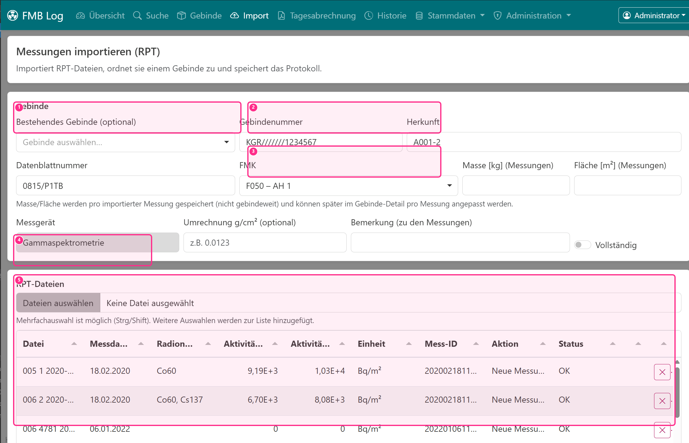

# Import (RPT)

Unter **Import** übernehmen Sie Protokolle aus der Gammaspektrometrie (RPT-Dateien) in die Datenbank. Der Import ist so gestaltet, dass er sowohl für den täglichen Betrieb (schnell mehrere Dateien übernehmen) als auch für Nachweise funktioniert (Originalprotokoll bleibt archiviert).

## Was passiert beim Import?

Beim Import liest FMB Log die RPT-Datei ein, extrahiert die für die Auswertung relevanten Inhalte (u. a. Messzeitpunkt, ISO-11929-Werte) und speichert zusätzlich das **Originalprotokoll** im Archiv.

## Ablaufdiagramm

## Schritt-für-Schritt

Zuerst wählen Sie (optional) ein bestehendes Gebinde aus oder legen ein neues an, indem Sie die Gebindenummer eintragen. Wenn Sie ein bestehendes Gebinde auswählen, werden dessen Stammdaten als Vorlage geladen.

::: warning Hinweis
Beim Import werden Stammdaten eines bestehenden Gebindes **nicht** geändert – Aktualisierungen erfolgen im Menü **Gebinde**. Möchten Sie ein Gebinde nur als Vorlage nutzen, ändern Sie die **Gebindenummer**; dann wird automatisch ein **neues** Gebinde angelegt.
:::

Danach ergänzen Sie bei Bedarf Stammdaten wie Herkunft, Datenblattnummer und (optional) eine FMK. **Masse/Fläche** werden (falls angegeben) **pro importierter Messung** gespeichert und können später im Gebinde-Detail pro Messung angepasst werden.

- (1) Bestehendes Gebinde auswählen (optional)
- (2) Gebindenummer eintragen (legt ein neues Gebinde an)
- (3) FMK als Filter/Zuordnung wählen (optional, aber empfohlen)
- (4) RPT-Dateien auswählen (Mehrfachauswahl möglich)
- (5) Dateitabelle prüfen (Mess‑ID, Aktion, Status)

Falls im Protokoll Messwerte in unterschiedlichen Einheiten vorkommen (z. B. massenspezifisch vs. oberflächenspezifisch), kann eine **Umrechnung** über $g/cm^2$ hinterlegt werden. Diese wird genutzt, um Werte zwischen $Bq/g$ und $Bq/cm^2$ umrechnen zu können.

Anschließend wählen Sie die RPT-Dateien aus. Die Dateiauswahl unterstützt **Mehrfachauswahl** – weitere Auswahlen werden **zur Liste hinzugefügt**, nicht ersetzt.

Für jede Datei schlägt FMB Log automatisch eine **Mess-ID** vor. Diese Mess-ID kann bei Bedarf angepasst werden (maximal 16 Zeichen). Sie ist entscheidend für die Versionierung: Wird später erneut eine Datei mit derselben Mess-ID importiert, entsteht eine **neue Revision** der Messung.

## Konflikte bei bestehenden Mess-IDs

Wenn eine ausgewählte Datei eine Mess-ID hat, die bereits existiert, markiert FMB Log die Zeile als **Konflikt**. Über den **Vergleich-Button** (↔) können Sie die wichtigsten Unterschiede zwischen vorhandener und neuer Datei ansehen (z. B. Messdatum, ISO-Einheit, Gamma-Summen, erkannte Gamma-Nuklide).

Danach wählen Sie pro Datei die passende Aktion:

- **Neue Revision**: erzeugt eine neue Revision der bestehenden Mess-ID; die vorherige Revision wird als nicht mehr aktuell markiert (Audit-Trail bleibt erhalten).
- **Neue Messung**: vergibt eine neue Mess-ID und importiert als separate Messung (keine Beeinflussung der bestehenden Mess-ID).
- **Überspringen**: lässt die Datei in der Liste, importiert sie aber nicht.

## Hinweise

- **FMK ist optional**, aber empfohlen: Nur mit FMK (inkl. Nuklidvektor) können Vorschauwerte wie Aktivität/OG zuverlässig berechnet werden.
- Die Tabelle der ausgewählten Dateien zeigt u. a. Messdatum, erkannte Gamma-Nuklide sowie Vorschauwerte (BS/OG). Wenn erforderliche Stammdaten fehlen, wird die Vorschau als „ungültig" markiert.
- Das **Messdatum** kann in der Dateitabelle per Klick bearbeitet werden. Dafür ist die Berechtigung `measurements.update_date` nötig. Das Originaldatum aus dem Protokoll bleibt zusätzlich gespeichert.
- Wenn eine Datei nicht geparst werden kann, wird sie als Fehler markiert und blockiert den Import.
- Die Bemerkung im Import-Dialog wird pro importierter Messung gespeichert.
- Bei **Offline-Import** ist das Protokoll zunächst nur auf dem importierenden Rechner verfügbar. Andere Arbeitsplätze können die Messung sehen, das Protokoll jedoch erst öffnen, nachdem der Upload erfolgt ist.

::: info Kurzfassung (Import)
1. Gebinde auswählen/anlegen, optional FMK wählen
2. RPT-Dateien per Mehrfachauswahl hinzufügen
3. Mess-ID prüfen (bei Konflikt: Vergleich öffnen, Revision/Neue Messung/Überspringen wählen)
4. Import starten
:::
