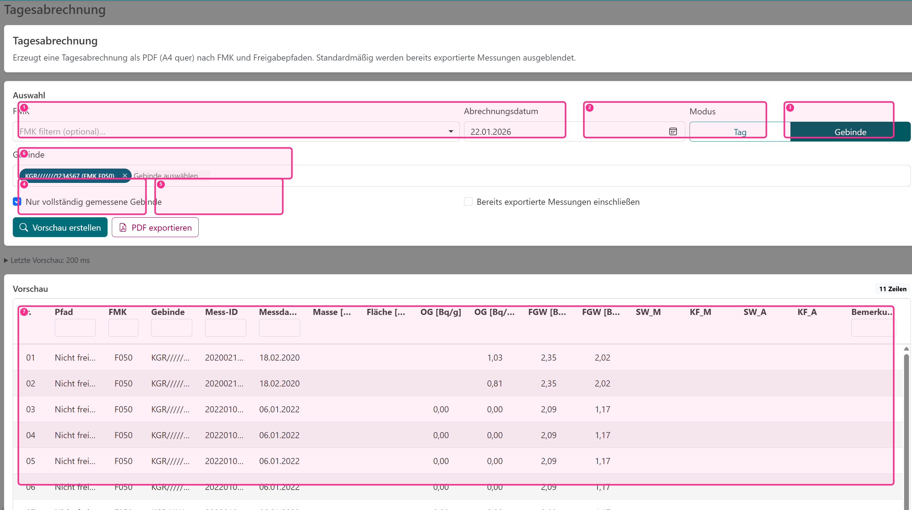
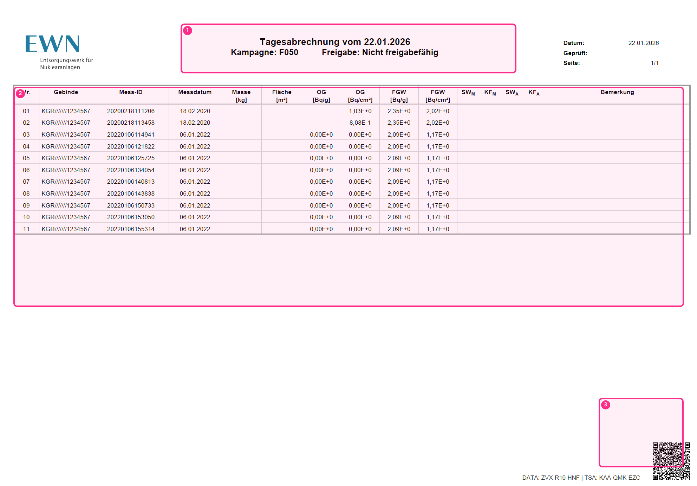
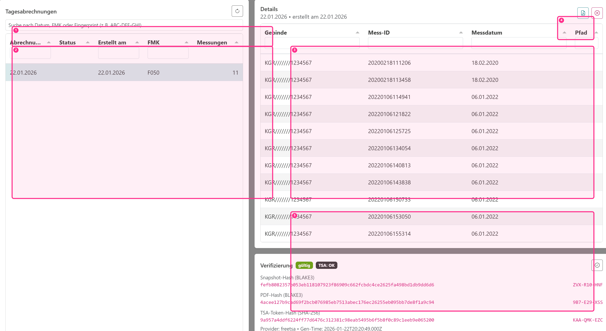
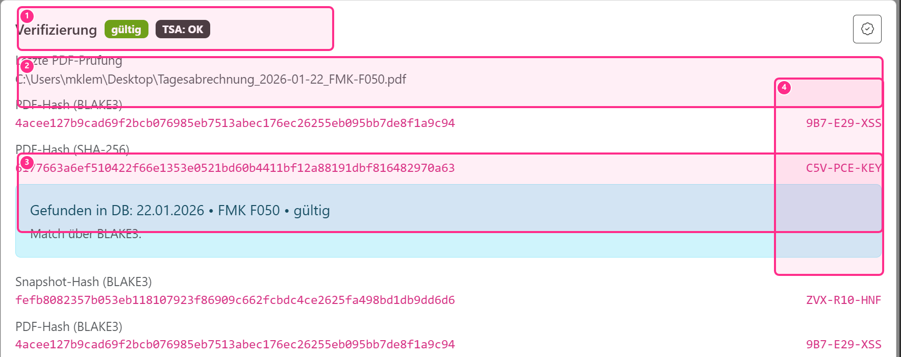

# Tagesabrechnung

Die Tagesabrechnung ist der zentrale Export in FMB Log. Sie fasst Messungen zusammen und erzeugt daraus ein PDF im Querformat. Die Anwendung unterstützt zwei Arbeitsweisen: **nach Tag** (operativ am Messtag) und **nach Gebinde** (gezielt für einzelne Gebinde, auch über mehrere Tage verteilt).

## Ablaufdiagramm

## Modi

Im Modus **Tag** werden alle Gebinde berücksichtigt, die am ausgewählten Messtag Messungen haben. Im Modus **Gebinde** wählen Sie gezielt Gebindenummern aus; die Abrechnung umfasst dann alle Messungen dieser Gebinde, unabhängig vom Messtag.

::: info Kurzfassung (Modi)
- **Tag**: operativ – „Was wurde an diesem Tag gemessen?"
- **Gebinde**: gezielt – „Welche Messungen gehören zu diesem Gebinde?"
:::

## Filter

Die Filter dienen dazu, den Export kontrolliert zu halten:

- **Nur vollständig**: Standardmäßig werden nur Gebinde exportiert, die als vollständig markiert sind (damit keine „halben" Gebinde in der Abrechnung landen).
- **Bereits exportierte Messungen einschließen**: Standardmäßig **aus**, um doppelte Exporte zu vermeiden.

::: tip Empfehlung
Markieren Sie ein Gebinde erst dann als vollständig, wenn keine weiteren Messungen mehr erwartet werden.
:::

## Vorschau & Export

Der Workflow ist zweistufig: Zuerst erzeugen Sie eine **Vorschau**, dann exportieren Sie das PDF. So können Sie die Inhalte vor dem finalen Export prüfen.

- (1) FMK als Filter (optional)
- (2) Abrechnungsdatum
- (3) Modus (Tag/Gebinde)
- (4) Vorschau erstellen
- (5) PDF exportieren
- (6) Filter „Nur vollständig“
- (7) Vorschau‑Tabelle

Wenn **keine FMK** gewählt ist, erstellt die Anwendung die Tagesabrechnung automatisch für **alle passenden FMKs** (z. B. mit Messungen am gewählten Tag). Die FMK-Auswahl dient dann nur als optionaler Filter.

Nach erfolgreichem Export setzt FMB Log pro Messung ein Export-Flag. Dadurch werden Messungen nicht versehentlich mehrfach exportiert (außer Sie aktivieren explizit den Filter „Bereits exportierte Messungen einschließen").

::: info Kurzfassung (Vorgehen)
1. Optional: FMK als Filter auswählen (oder leer lassen für „alle passenden")
2. Modus/Datum/Gebinde wählen
3. Vorschau erzeugen und prüfen
4. PDF exportieren
5. Export in der Historie nachvollziehen
:::

## QR-Code & optionaler Zeitstempel

Jede exportierte Tagesabrechnung enthält unten rechts in der Fußzeile einen **QR-Code**. Dieser enthält eine eindeutige Kennung der exportierten Datenbasis und dient als Referenz in der Historie.

- (1) Kopfzeile (Datum/FM K/Freigabepfad)
- (2) Tabelle der enthaltenen Messungen
- (3) QR‑Code + Fingerprints (z. B. `DATA: ...`)

Optional kann der Admin den Export so konfigurieren, dass zusätzlich ein **Zeitstempel** (RFC 3161) erzeugt wird. In diesem Fall ist für den PDF-Export eine Internetverbindung erforderlich.

## Historie & Verifikation

Alle exportierten Tagesabrechnungen werden unter **Historie** gespeichert. Dort können Sie:

- eine Tagesabrechnung auswählen und die enthaltenen Messungen ansehen,
- das zugehörige PDF öffnen (falls der Pfad gespeichert ist),
- optional eine vorhandene PDF-Datei gegen die Datenbank prüfen.

- (1) Suche (Datum, FMK oder Fingerprint)
- (2) Liste der Tagesabrechnungen (links)
- (3) Details: enthaltene Messungen (rechts)
- (4) PDF öffnen / ungültig markieren (Icons)
- (5) Verifizierung (Snapshot/TSA)

### Status in der Historie

In der Historie wird der Status einer Tagesabrechnung klar angezeigt:

- **gültig**: Die Tagesabrechnung ist weiterhin konsistent mit den enthaltenen Messdaten.
- **ungültig**: Entweder wurde eine enthaltene Messung nachträglich ungültig gesetzt **oder** die Tagesabrechnung wurde manuell ungültig gemacht.

Mit der Berechtigung `reports.invalidate` kann eine Tagesabrechnung in der Historie manuell ungültig gemacht werden. Dabei werden die Export-Markierungen der enthaltenen Messungen zurückgesetzt, sodass diese bei Bedarf erneut exportiert werden können.

### Suche nach Fingerprints

Das Suchfeld in der Historie akzeptiert neben Datum und FMK auch **Fingerprints** (Kurzform wie `ABC-DEF-GHI`). Damit können Sie schnell von einem Wert aus der PDF zum passenden Datenbank-Eintrag springen.

### PDF prüfen…

Mit **PDF prüfen…** können Sie eine Datei auswählen; FMB Log berechnet die Prüfsumme der PDF und sucht nach dem passenden Tagesabrechnungs-Eintrag in der Datenbank.

Typischer Anwendungsfall: Sie haben die Original-PDF aus einem Export vorliegen und wollen verifizieren, ob sie genau zu einer gespeicherten Tagesabrechnung gehört und ob diese noch gültig ist.

- (1) Status (gültig / TSA)
- (2) geprüfte Datei (Pfad)
- (3) Match in der Datenbank
- (4) Fingerprints (Kurzform)

::: warning Hinweis
Die Prüfung funktioniert nur für die **unveränderte Original-PDF**. Sobald eine PDF neu gespeichert, gedruckt/gescannt oder anderweitig verändert wurde, stimmt die Prüfsumme nicht mehr überein.
:::

## Abschnitte

Eine Tagesabrechnung ist in Abschnitte unterteilt:

- **Nicht freigabefähig**: Messungen/Gebinde, die keinen der geprüften Pfade bestehen.
- Danach je Freigabepfad ein eigener Abschnitt. Jeder Pfad beginnt auf einer neuen Seite.

## Tabellenspalten (Vorschau/PDF)

Die Vorschau und die PDF verwenden dieselbe fachliche Logik und zeigen die wichtigsten Werte pro Messung an (z. B. OG/FGW in $Bq/g$ bzw. $Bq/cm^2$).

### SW/KF getrennt nach Masse/Fläche

Da für viele Freigabepfade eine **Kombination aus massenspezifischem und oberflächenspezifischem Pfad** erforderlich sein kann (z. B. `1a (mit OF)`), werden Schwellenwert und Korrekturfaktor separat ausgewiesen:

- **SW_M / KF_M**: Faktoren für die **massenbezogene** Prüfung (Einheit $Bq/g$).
- **SW_A / KF_A**: Faktoren für die **flächenbezogene** Prüfung (Einheit $Bq/cm^2$).

Wenn ein Faktor nicht hinterlegt ist, bleibt die Zelle leer (fachlich gilt dann $SW = 1$ bzw. $KF = 1$).

### Fußnoten für angepasste Werte

Wenn OG/FGW unter Berücksichtigung von SW/KF angepasst wurden, wird dies direkt am Wert markiert:

- `*` unter Berücksichtigung des Korrekturfaktors (KF)
- `**` unter Berücksichtigung des Schwellenwertes (SW)
