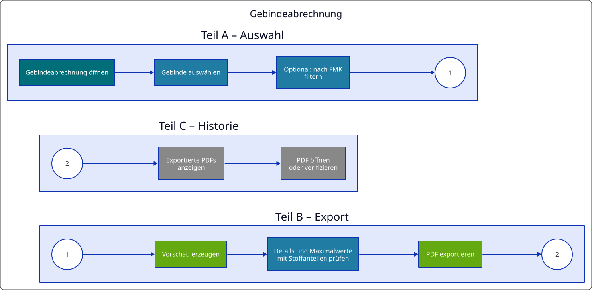
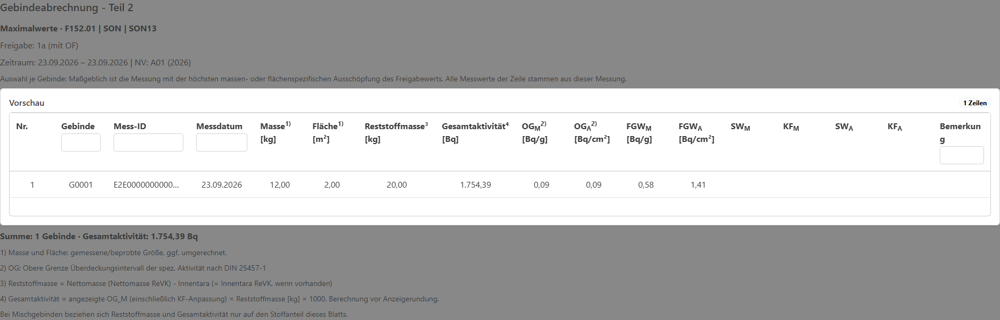
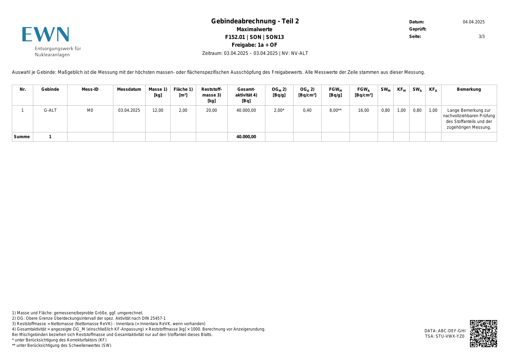

# Gebindeabrechnung

Die Gebindeabrechnung erzeugt ein PDF im A4-Querformat mit **Teil 1 – Details** und **Teil 2 – Maximalwerte**. Vorschau und PDF verwenden denselben eingefrorenen Datenstand.

## Auswahl und Ablauf

1. Optional eine FMK filtern; ohne Filter stehen die Gebinde aller FMKs zur Auswahl.
2. Gebinde und Abrechnungsdatum wählen. Der Filter **Nur vollständig gemessene Gebinde** ist standardmäßig aktiv.
3. **Vorschau erstellen** und beide Teile einschließlich der Hinweise prüfen.
4. **PDF exportieren**. Der Export erscheint anschließend in der Historie.

Einbezogen werden **alle aktuellen gültigen Messrevisionen** der ausgewählten Gebinde, auch bereits exportierte Messungen. Ungültige und ersetzte Revisionen sind ausgeschlossen. Messtagsauswahl und Exportfilter entfallen: Ein früherer Export darf die Ermittlung des Gebindemaximums nicht einschränken.

## Blattaufteilung und Kopfzeilen

Die Hauptüberschriften lauten **Gebindeabrechnung - Teil 1** und **Gebindeabrechnung - Teil 2**, ohne Datum im Titel. Darunter steht jeweils **Details** beziehungsweise **Maximalwerte**. Das Erstellungsdatum bleibt im bisherigen Kopfzeilenblock neben „Geprüft“ und der durchgängigen Seitennummerierung.

Die Blätter werden nach FMK, Charge und Freigabepfad aufgeteilt. **SON und NEM werden zusätzlich nach Stoffklasse getrennt.** Beispiele:

| Blattüberschrift | Umfang |
| --- | --- |
| `F050.01 \| CST` | Alle CST-Stoffklassen dieser Charge |
| `F152.01 \| SON \| SON13` | Nur SON13 |
| `F152.02 \| NEM \| NEM02` | Nur NEM02 |

Pro FMK ist eine Charge je Stoffart erforderlich. Mehrere Chargen derselben Stoffart müssen vor der Abrechnung korrigiert werden. Bestandsdaten bleiben hierfür bearbeitbar.

„Nicht freigabefähig“ bleibt ein eigener Abschnitt; danach folgen die Freigabepfade in FMK-Reihenfolge. Jeder Abschnitt beginnt auf einer neuen Seite. Das PDF enthält zuerst alle Detailabschnitte, dann alle Maximalwertabschnitte in derselben Reihenfolge.

**Mischgebinde** erscheinen auf jedem betroffenen Blatt. Die Messwerte bleiben gleich, Reststoffmasse und Gesamtaktivität beziehen sich jeweils ausschließlich auf die zugehörigen Stoffanteile. Die Gebindeanzahlen unterschiedlicher Materialblätter dürfen deshalb nicht zu einer eindeutigen Gesamtgebindeanzahl addiert werden.

## Teil 1 – Details

Dieser Teil enthält jede ausgewertete Messung. **Masse und Fläche gehören zur Messung**, nicht zum gesamten Gebinde. Die gemeinsame Fußnote steht an erster Stelle (Fußnote **1**):

> gemessene/beprobte Größe, ggf. umgerechnet.

Teil 1 enthält keine Summenzeile.

## Teil 2 – Maximalwerte

Pro Gebinde und Blattabschnitt erscheint **eine maßgebliche Messung**. Ausschlaggebend ist die größere massen- oder flächenspezifische Ausschöpfung:

$$
q = \max\left(\frac{OG_M}{FGW_M},\frac{OG_A}{FGW_A}\right)
$$

Verwendet werden die bereits um KF beziehungsweise SW angepassten, ungerundeten Werte. Alle Messwerte und Faktoren der Zeile stammen aus derselben Messung. Die Mess-ID und das Messdatum machen die Quelle nachvollziehbar. Die Auswahlregel steht als unnummerierter Hinweis **„Auswahl je Gebinde“** direkt unter Zeitraum und NV oberhalb der Tabelle; sie ist keine Fußnote am Untertitel. Bei Gleichstand entscheiden aufsteigend Messzeitpunkt, Mess-ID und Revisionskennung.

Der Untertitel nennt den Zeitraum vom frühesten bis zum spätesten enthaltenen Messdatum sowie die verwendeten Nuklidvektoren mit Jahresversion. Der Zeitraum umfasst **alle Messungen des Abschnitts**, nicht nur die ausgewählten Maximalwertmessungen.

### Reststoffmasse und Gesamtaktivität

Die gespeicherten Stoffklassenmassen sind bereits Reststoffmassen nach Abzug der Innentara. Pro Blatt werden nur die zugehörigen Stoffklassenmassen summiert. Es erfolgt kein weiterer Taraabzug und es werden keine zusätzlichen ReVK-Felder benötigt.

Die Fußnote zur Reststoffmasse lautet:

> Reststoffmasse = Nettomasse (Nettomasse ReVK) - Innentara (= Innentara ReVK, wenn vorhanden)

Die zusätzliche Gesamtaktivität wird aus der **angezeigten OG_M einschließlich KF-Anpassung** berechnet. Die Berechnung verwendet den Wert vor Anzeigerundung:

$$
A_{\mathrm{Gebindeanteil}}[\mathrm{Bq}] = OG_M[\mathrm{Bq/g}] \cdot m_{\mathrm{Reststoffanteil}}[\mathrm{kg}] \cdot 1000
$$

Die Zeile am Abschnittsende summiert **Gebindeanzahl und Gesamtaktivität**. Die Aktivitätssumme wird aus ungerundeten Zahlen gebildet. Masse und Fläche der ausgewählten Messung bleiben zusätzlich sichtbar und sind von der Reststoffmasse zu unterscheiden.

### Beispiel einer Mischgebindeabrechnung

Ein Gebinde enthält 10 kg CST und 20 kg SON13. Messung A schöpft massenspezifisch 80 % und flächenspezifisch 20 % aus. Messung B erreicht 50 % beziehungsweise 90 %. **Messung B ist maßgeblich**, weil 90 % die höchste Ausschöpfung ist.

Bei einer angezeigten OG_M von 0,5 Bq/g ergeben sich auf dem CST-Blatt 5.000 Bq und auf dem SON13-Blatt 10.000 Bq. Die beiden Anteile ergeben zusammen 15.000 Bq; die volle Gebindemasse wird nicht auf jedem Blatt erneut angesetzt.

### Fehlende Grundlagen

Nicht berechenbare Werte bleiben als solche gekennzeichnet und werden nicht durch Null ersetzt. Fehlen erforderliche Vergleichswerte einer Messung, wird das ermittelte Maximum als **unvollständig** markiert. Fehlende massenspezifische OG oder eine nicht verfügbare Umrechnung können die Gesamtaktivitätsberechnung verhindern. Betroffene Aktivitätssummen sind als unvollständig gekennzeichnet; ein angezeigter Zahlenwert ist dann nur die Summe der berechenbaren Anteile. Fehlende Messdaten machen auch den Zeitraum unvollständig.

## Indizes und Fußnoten

- **M**: massenspezifisch; **A**: flächenspezifisch. OG, FGW, SW und KF tragen diese Indizes.
- **Fußnote 2 – OG**: „Obere Grenze Überdeckungsintervall der spez. Aktivität nach DIN 25457-1“.
- **\***: unter Berücksichtigung des Korrekturfaktors (KF).
- **\*\***: unter Berücksichtigung des Schwellenwertes (SW).
- Die Maximalwertauswahl, Aktivitätsformel und anteilige Behandlung von Mischgebinden werden unmittelbar auf der Abrechnung erläutert.

## Historie und Verifikation

Der Desktop-Export speichert die eindeutige Messliste, Berechnungsgrundlagen, Blattzuordnungen und Maximalwerte in einem unveränderlichen Datenstand (Snapshot-Version 4). Mehrfachdarstellungen eines Mischgebindes erzeugen keine doppelten Messverknüpfungen. QR-Code, Fingerprints und RFC-3161-Zeitstempel beziehen sich auf dieses gespeicherte Paket.

Unter **Historie** lassen sich das PDF und die verwendeten Daten öffnen, Fingerprints suchen und Original-PDFs gegen die gespeicherten Prüfsummen prüfen. Alte Tagesabrechnungen einschließlich Version-3-Snapshots bleiben lesbar; ihre PDFs und ursprünglichen Daten werden nicht umgeschrieben.

Änderungen an enthaltenen Messungen oder Gebinde-Stammdaten verwenden weiterhin das bestehende Invalidierungsverfahren. Mit `reports.invalidate` kann eine Abrechnung manuell ungültig gemacht werden. Der Exportstatus dokumentiert weiterhin den Export, begrenzt aber nicht mehr den Messumfang einer neuen Gebindeabrechnung.

Die PDF-Prüfung gilt für die unveränderte Originaldatei. Neu gespeicherte oder eingescannte PDFs besitzen eine andere Prüfsumme.

Die fachlichen Entscheidungen sind in [ADR-005: Gebindeabrechnung](../architecture/adr-005-gebindeabrechnung.md) dokumentiert.
