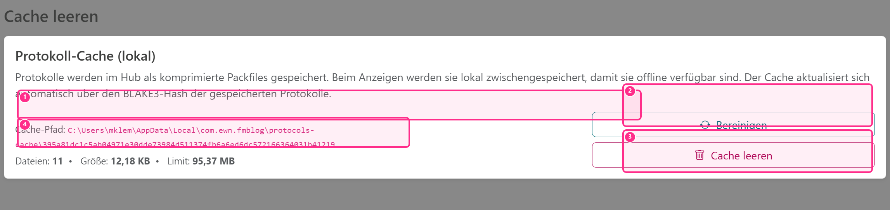
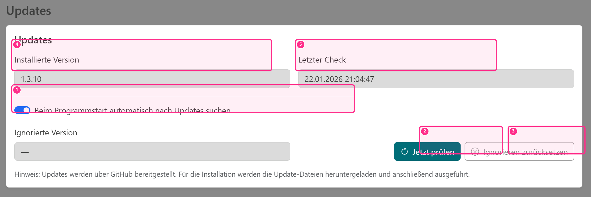

# Einstellungen

## Datenbankpfad

Standard ist eine lokale Datenbank-Datei im Programmordner. Optional kann eine andere Datenbank-Datei ausgewählt werden (z. B. Netzlaufwerk). Diese Einstellung ist in der Regel **nur für Administratoren** verfügbar (Menü: **Administration → Einstellungen**).

Ein Netzlaufwerk kann sinnvoll sein, wenn mehrere Arbeitsplätze auf dieselbe Datenbank zugreifen sollen.

::: warning Hinweis (Mehrbenutzerbetrieb)
- Testen Sie den Mehrbenutzerbetrieb unter realistischen Bedingungen.
- Planen Sie regelmäßige Backups ein.
:::

::: info Kurzfassung
- Standard: lokaler Programmordner
- Optional: anderer Pfad (z. B. Netzlaufwerk)
:::

## Verbindungsstatus (Hub/Synchronisation)

Unten links in der Anwendung wird angezeigt, ob die lokale Datenbank mit dem Hub synchronisieren kann und **wann der letzte erfolgreiche Sync** war:

- **Hub: verbunden** → Sync läuft regulär.
- **Hub: instabil** → einzelne Sync-Versuche schlagen fehl, die App arbeitet aber weiter lokal.
- **Hub: offline** → der Hub ist nicht erreichbar.

Die Zeitangabe „letzter Sync" wird in der **lokalen Zeitzone** des Rechners angezeigt.

::: info Kurzfassung (Statusanzeige)
- Anzeige hilft beim Arbeiten im Netzlaufwerk-Betrieb („Bin ich gerade online am Hub?").
- Bei „offline" bleiben lokale Änderungen möglich, werden aber erst nach erfolgreichem Sync verteilt.
:::

## Protokoll-Cache (lokal)

Damit Messprotokolle auch ohne Hub-Verbindung angezeigt werden können, nutzt FMB Log einen **lokalen Protokoll-Cache**. Beim Import werden Protokolle immer in diesen Cache geschrieben. Ist der Hub erreichbar, werden sie zusätzlich hochgeladen; ist der Hub nicht erreichbar, wird der Upload später automatisch nachgeholt.

- (1) Cache‑Pfad (lokal)
- (2) Bereinigen (alte Einträge entfernen)
- (3) Cache leeren
- (4) Statistik (Dateien / Größe / Limit)

Der Cache wird automatisch verwaltet: ältere, nicht mehr benötigte Einträge werden bei Bedarf entfernt. Unter **Administration → Cache leeren** können Sie den Cache-Pfad und die aktuelle Cache-Größe einsehen. Zusätzlich gibt es dort die Aktion **Bereinigen**.

::: warning Hinweis (Cache leeren)
- Wenn Sie den Cache leeren, können Protokolle offline nicht mehr angezeigt werden, bis der Hub wieder erreichbar ist.
- Leeren Sie den Cache nur, wenn der Hub erreichbar ist und ausstehende Uploads bereits erfolgt sind.
:::

## Updates

FMB Log kann Updates automatisch über den integrierten Updater beziehen. Die Einstellungen finden Sie im Benutzer-Menü oben rechts unter **Updates**.

- (1) Automatisch beim Start nach Updates suchen
- (2) „Jetzt prüfen“ (manuelle Prüfung)
- (3) „Ignorieren zurücksetzen“
- (4) Installierte Version
- (5) Letzter Check

- **Beim Programmstart automatisch nach Updates suchen**: Ist diese Option aktiv, prüft FMB Log beim Start, ob eine neue Version verfügbar ist.
- Wenn ein Update gefunden wurde, erscheint ein Hinweis mit drei Optionen:
  - **Jetzt installieren**: Download und Installation starten.
  - **Beim nächsten Start erinnern**: Hinweis schließen (bei nächstem Start erneut prüfen).
  - **Nicht mehr erinnern**: Die gefundene Version wird ignoriert, bis Sie die Ignorierung zurücksetzen oder ein neueres Update verfügbar ist.
- Zusätzlich kann ein Update jederzeit manuell über **Jetzt prüfen** gesucht werden.

Wichtig: Update-Einstellungen werden **nur lokal** gespeichert (in der lokalen Replica-Datenbank) und nicht mit dem Hub synchronisiert.
